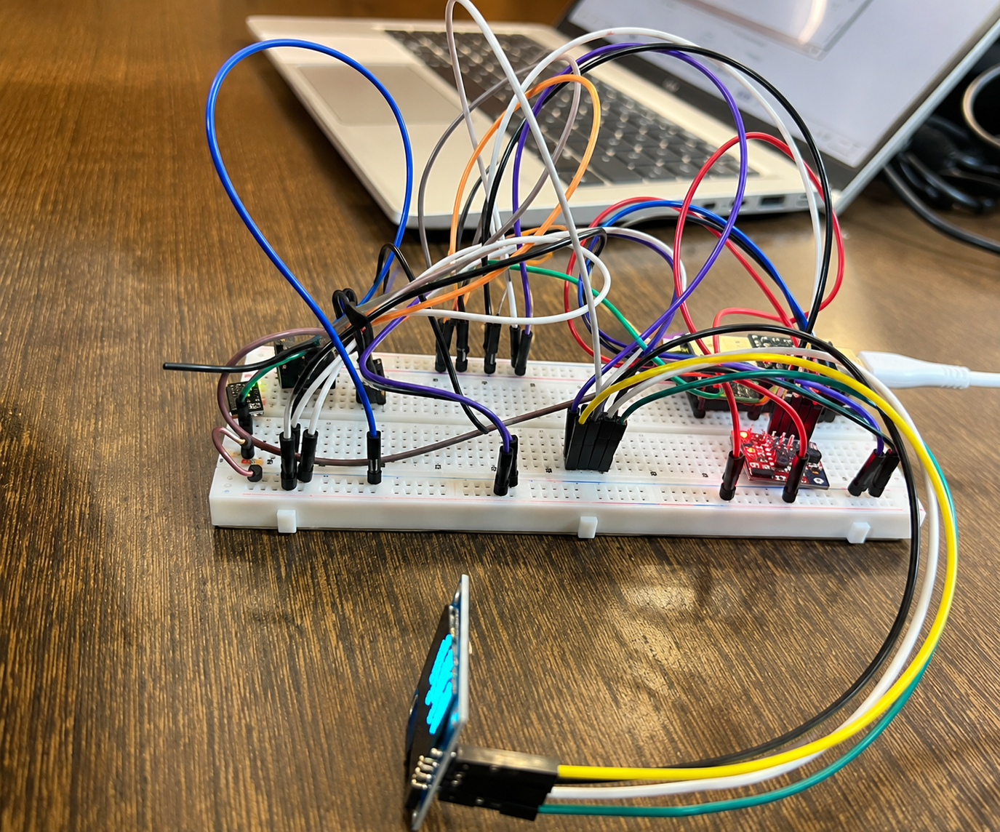
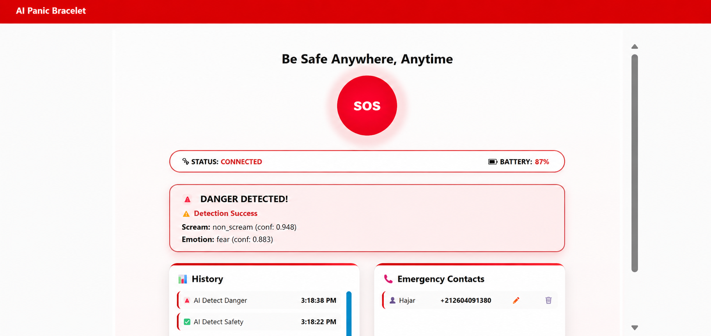

# 🚨 AI Panic Bracelet – Système Intelligent de Détection de Situations de Danger

<p align="center">
  
  
  
  
  
  
</p>

---

# 📖 Présentation

**AI Panic Bracelet** est un prototype de bracelet intelligent conçu pour améliorer la sécurité des personnes grâce à une approche multimodale combinant l'Internet des Objets (IoT) et l'Intelligence Artificielle.

Le système surveille en temps réel les données physiologiques et comportementales de l'utilisateur afin de détecter automatiquement des situations de danger.

Lorsqu'un événement critique est identifié, le bracelet transmet les informations à une plateforme de supervision via MQTT afin de générer une alerte.

---

# 📷 Prototype

<p align="center">
    
</p>

---

# 🎯 Objectifs

- Détecter automatiquement les situations de danger.
- Surveiller la fréquence cardiaque.
- Détecter les mouvements anormaux.
- Détecter les cris de détresse.
- Reconnaître les émotions vocales.
- Envoyer des alertes en temps réel.
- Développer une solution IoT embarquée intelligente.

---

# 🚀 Fonctionnalités

- ❤️ Surveillance de la fréquence cardiaque
- 🏃 Détection des mouvements
- 😱 Détection automatique des cris
- 🎭 Reconnaissance des émotions vocales
- 📡 Communication Wi-Fi
- 📨 Communication MQTT
- 🌐 Tableau de bord Node-RED
- 💻 Serveur Flask
- 📺 Affichage OLED SSD1306
- 📳 Vibreur
- 🔘 Déclenchement manuel de l'alerte
- ❌ Annulation de l'alerte par double clic

---

# 🛠️ Matériel utilisé

| Composant | Description |
|-----------|-------------|
| ESP32 | Microcontrôleur principal |
| MPU6050 | Capteur de mouvement |
| MAX30105 | Capteur de fréquence cardiaque |
| OLED SSD1306 | Écran OLED |
| Bouton poussoir | Déclenchement manuel |
| Vibreur | Retour haptique |

---

# 🧠 Intelligence Artificielle

Le système combine plusieurs modèles d'intelligence artificielle.

## Détection des cris

- Modèle : **YAMNet**
- Framework : TensorFlow
- Classification : **Scream / Non-Scream**

## Reconnaissance des émotions

- Modèle : **Wav2Vec2**
- Dataset : **CREMA-D**

Émotions détectées :

- Happy
- Sad
- Angry
- Fear
- Neutral
- Disgust

## Détection des mouvements

- Plateforme : **Edge Impulse**
- Capteur : **MPU6050**

Classes :

- Safe
- Danger

---

# ⚙️ Architecture du système

```text
              ESP32
                 │
     ┌───────────┴───────────┐
     │                       │
 MAX30105                MPU6050
(BPM)                 (Mouvements)
     │                       │
     └───────────┬───────────┘
                 │
             MQTT Broker
                 │
             Node-RED
                 │
            Serveur Flask
                 │
      ┌──────────┴───────────┐
      │                      │
 Détection des cris      Reconnaissance
      (YAMNet)           des émotions
                           (Wav2Vec2)
                 │
        Détection du danger
                 │
        Notification / Alerte
```

---

# 💻 Interface utilisateur

L'application permet de suivre en temps réel l'état du bracelet, les alertes détectées ainsi que l'historique des événements.

<p align="center">
    
</p>

---

# 🛠️ Technologies utilisées

### Langages

- Python
- C++

### Intelligence Artificielle

- TensorFlow
- PyTorch
- YAMNet
- Wav2Vec2
- Edge Impulse

### IoT

- ESP32
- MQTT
- Mosquitto
- Node-RED

### Développement

- PlatformIO
- Arduino Framework
- Flask

### Capteurs

- MPU6050
- MAX30105
- OLED SSD1306

